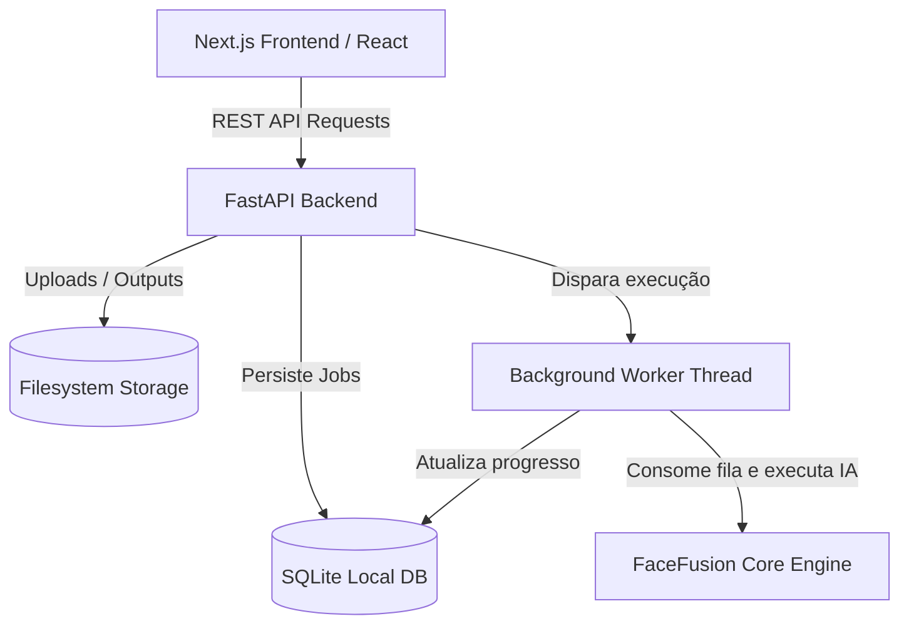

# PRD — FaceFusion Modernizado (Decoupled Architecture)

## 1. Overview

### Product Summary
O **FaceFusion Modernizado** é uma plataforma líder de manipulação e processamento de faces (Face Swap, Face Enhancement, etc.) reformulada sob uma arquitetura desacoplada (decoupled). O sistema separa a lógica de execução de modelos de IA e inteligência computacional de mídia (FastAPI/Python) da camada de interação visual e experiência de usuário (Next.js/React/TypeScript), proporcionando alta fidelidade visual, monitoramento de tarefas em tempo real e facilidade de deploy.

### Objective
Este documento descreve os requisitos de produto, funcionais e técnicos para a consolidação da arquitetura desacoplada do FaceFusion. A meta é garantir uma interface web altamente premium, fluida, offline-first e integrada a uma API REST local robusta que gerencia filas de processamento assíncrono (jobs), monitoramento de hardware, parametrização avançada e controle de ciclo de vida de processadores.

### Market Differentiation
Diferente da interface Gradio monolítica original, que mistura renderização de UI com execução de processos pesados na mesma thread de backend limitando a responsabilidade do layout, esta arquitetura desacoplada Next.js + FastAPI oferece:
* Desempenho assíncrono real com controle granular de jobs através de um banco de dados SQLite local.
* Layout web de alto padrão visual, responsivo e baseado em Tailwind CSS com microinterações ricas.
* Comparador deslizante de frames (Antes/Depois) interativo diretamente na tela do cockpit.
* Gerenciador de configurações de execução e exportação de relatórios diagnósticos nativos.

### Magic Moment
O usuário envia a foto de origem da face (Source) e o vídeo ou imagem de destino (Target), inicia o processamento e acompanha o progresso em tempo real no Dashboard. Assim que concluído, com apenas um clique, o resultado é carregado em uma ferramenta comparadora interativa na tela, permitindo arrastar um divisor vertical para analisar em detalhes a precisão e o refinamento do frame alterado em relação à mídia original.

### Success Criteria
* Inicialização instantânea do frontend localmente (Next.js / Vite).
* Resiliência do backend FastAPI inicializando o banco de dados e os serviços de fila em qualquer porta local livre de forma automática.
* Sincronização em tempo real (polling curto ou SSE) do status de execução do job (queued, processing, completed, failed) com barra de progresso visual.
* Suporte a aceleração de hardware (CUDA, ROCm) detectado dinamicamente no backend e exibido em tempo real no header superior.
* Limpeza e higienização automática do pacote de diagnóstico exportado, garantindo a proteção de caminhos pessoais (PII).

---

## 2. Technical Architecture

### Architecture Overview
A aplicação baseia-se em uma arquitetura de cliente-servidor puramente local (Local Client-Server):
1. **Frontend (Next.js)**: Uma SPA (Single Page Application) ou SSR desacoplado que se comunica com a API local via requisições HTTP REST.
2. **Backend (FastAPI)**: Expõe rotas para uploads de mídias, gerencia configurações em memória/INI e delega o processamento pesado de IA para um Worker assíncrono em segundo plano (background thread).
3. **Database (SQLite)**: Persiste metadados dos jobs, logs de progresso e referências físicas das mídias.



### Chosen Stack
| Layer | Choice | Rationale |
|---|---|---|
| **Frontend** | Next.js + React + TypeScript | Ecossistema maduro, excelente gerenciamento de estado client-side, tipagem robusta e renderização ágil. |
| **Styling** | Tailwind CSS + Lucide Icons | Desenvolvimento rápido de layout modular, responsividade nativa e consistência com temas premium escuros (Linear/Vercel). |
| **Backend** | FastAPI + Uvicorn | API REST rápida e assíncrona em Python, com documentação automática (Swagger) e baixo overhead de comunicação. |
| **Database** | SQLite + SQLAlchemy ORM | Banco leve, sem necessidade de servidores externos, autocontido em arquivo de disco local e compatível com queries ACID. |
| **IA Core** | ONNX Runtime / OpenCV / NumPy | Engenho de processamento nativo do FaceFusion para execução local de inferências com suporte a GPU e CPU. |

### Repository Structure
```
my-facefusion/
├── facefusion/                  # Código principal do motor Python
│   ├── api/                     # Camada desacoplada do backend REST
│   │   ├── database.py          # Configurações SQLAlchemy e schema SQLite
│   │   ├── main.py              # Ponto de entrada FastAPI e roteamento estático
│   │   ├── routes.py            # Endpoints da API REST (Jobs, Config, Mídia)
│   │   └── worker.py            # Thread de processamento assíncrono dos Jobs
│   ├── core.py                  # Lógica de processamento de frames
│   ├── jobs.py                  # Gerenciador de jobs nativo
│   └── state_manager.py         # Configurações globais em memória
├── frontend/                    # Cliente web Next.js
│   ├── src/
│   │   ├── app/
│   │   │   ├── page.tsx         # Dashboard Cockpit principal e fluxo de navegação
│   │   │   ├── globals.css      # Customização e cores globais Tailwind
│   │   │   └── layout.tsx       # Estrutura base da página html
│   │   └── components/          # Componentes modulares reutilizáveis (se necessário)
│   ├── public/
│   │   └── config.json          # URL dinâmica da API gerada no start
│   ├── tsconfig.json
│   └── package.json
├── facefusion.py                # Entrada CLI legada
├── run_api.py                   # Script de inicialização da API + porta livre
└── docs/
    └── goal/
        ├── prd.md               # Este documento
        ├── design.md            # Tokens e guia visual
        └── product-roadmap.md   # Roadmap de desenvolvimento
```

### Security Considerations
* **Higienização de Logs (PII Masking)**: No exportador de pacotes diagnósticos, caminhos absolutos do sistema contendo nomes de usuários locais (`/home/username` ou `C:\Users\username`) e dados sensíveis devem ser obrigatoriamente mascarados para `/home/user` e `C:\Users\user` antes de compactar em ZIP.
* **Segurança de Sandbox**: O acesso aos arquivos locais de entrada/saída está restrito às pastas temporárias configuradas em `jobs_path` e `uploads`, prevenindo ataques de Path Traversal.

---

## 3. Data Model

### Entity Definitions (SQLite)
A entidade chave é a tabela `jobs`, mapeada no SQLite via SQLAlchemy (`JobModel`):

```typescript
export interface Job {
  id: string;                         // Identificador único (ex: job-1a2b3c4d)
  status: 'idle' | 'queued' | 'processing' | 'completed' | 'failed'; // Ciclo de vida
  progress: number;                   // Progresso em porcentagem (0 a 100)
  source_paths: string;               // Caminhos físicos das imagens de origem (JSON string)
  target_path: string;                // Caminho físico da mídia de destino (vídeo/imagem)
  output_path?: string;               // Caminho físico final do arquivo gerado
  face_swapper_weight?: number;       // Peso de mesclagem da face swapped
  face_mask_blur?: number;            // Nível de desfoque da máscara da face
  detection_threshold?: number;       // Limiar de detecção facial
  smoothing?: number;                 // Suavização temporal para vídeo
  processors: string;                 // Lista de processadores ativos (ex: ["face_swapper"] - JSON)
  error_message?: string;             // Mensagem de erro caso falhe
  created_at: string;                 // Timestamp de criação
  updated_at: string;                 // Timestamp da última atualização de estado
}
```

---

## 4. API Specification

A API REST expõe os seguintes endpoints mapeados sob o prefixo `/api`:

### 1. Hardware & Processadores
* **`GET /api/hardware/providers`**: Retorna os provedores de hardware disponíveis no host (ex: `["CUDAExecutionProvider", "CPUExecutionProvider"]`).
* **`GET /api/hardware/devices`**: Retorna telemetria detalhada de GPUs detectadas (Nome, Uso, Temperatura).
* **`GET /api/processors/list`**: Varre o diretório do motor do FaceFusion e retorna os processadores utilizáveis (ex: `["face_swapper", "face_enhancer"]`).

### 2. Configurações do Estado
* **`GET /api/config`**: Retorna os caminhos de persistência (`temp_path`, `jobs_path`), o nível de logs, número de threads e estratégia de memória do motor de processamento.
* **`POST /api/config`**: Atualiza variáveis de execução e caminhos temporários dinamicamente no gerenciador de estado.

### 3. Gerenciamento de Mídia
* **`POST /api/media/upload`**: Recebe arquivos de mídia via multipart form, gera nomes únicos seguros (UUID) e salva na pasta temporária. Retorna o caminho absoluto e a URL da API para renderização no frontend.
* **`GET /api/media/upload/{filename}`**: Retorna arquivos originais carregados para visualização na UI.
* **`GET /api/media/output/{filename}`**: Retorna arquivos processados de saída.

### 4. Ciclo de Vida dos Jobs
* **`GET /api/jobs`**: Retorna lista histórica ordenada de tarefas comerciais de swapping de faces.
* **`GET /api/jobs/{job_id}`**: Retorna detalhes de execução e progresso de um job específico.
* **`POST /api/jobs`**: Valida arquivos, resolve caminhos relativos/URLs, insere a tarefa no banco SQLite, monta o passo de processamento e aciona o background worker thread.
* **`DELETE /api/jobs/{job_id}`**: Exclui os registros no banco de dados e apaga os arquivos de mídia física correspondentes da saída e de jobs temporários no disco.

### 5. Diagnósticos
* **`GET /api/diagnostic/export`**: Compacta configurações `.ini`, logs e informações gerais do sistema em um ZIP compactado, higienizando caminhos absolutos do usuário.

---

## 5. User Stories

### Epic: Cockpit Operacional e Produção de Mídia
**US-001: Dashboard Unificado e Acompanhamento de Fila**
Como operador do FaceFusion, quero visualizar uma lista em tempo real com as últimas tarefas de processamento de face e suas respectivas barras de progresso para acompanhar a taxa de renderização local.
* *Critérios de Aceitação*:
  * Exibir cartões de jobs recentes com indicadores coloridos de status (Queued = Azul, Processing = Amarelo pulsante, Completed = Verde, Failed = Vermelho).
  * O progresso numérico (0-100%) deve atualizar a cada 2 segundos via polling curto.
  * O cartão de erro deve mostrar o campo `error_message` detalhado em caso de falha.

**US-002: Upload Rápido de Mídia e Visualização Integrada**
Como criador de conteúdo, quero poder arrastar ou carregar imagens e vídeos diretamente nos cards de entrada do Dashboard, para que eu configure rapidamente a imagem do rosto original (Source) e o vídeo final (Target).
* *Critérios de Aceitação*:
  * Cards de entrada devem possuir feedbacks visuais de hover ao arrastar mídias.
  * Se for vídeo, o player do Target deve possuir controles de play/pause e renderizar um checkbox "Processar a partir deste ponto" capturando o tempo corrente do player em segundos.

**US-003: Comparador Divisor "Antes / Depois"**
Como editor de vídeo, quero ter uma tela comparadora deslizante sobreposta após a conclusão do processamento de swap de rosto, para avaliar com alta definição a costura e o enquadramento do rosto inserido em relação ao vídeo original.
* *Critérios de Aceitação*:
  * O comparador deve carregar o vídeo Target (original) à esquerda e o vídeo Output (alterado) à direita.
  * O usuário arrasta uma barra divisora vertical de 0 a 100% que ajusta de forma síncrona a largura visível de ambos os arquivos de mídia posicionados na mesma coordenada.

---

## 6. Functional Requirements

* **FR-001: Detecção Automática de Porta Livre**: O script de start (`run_api.py`) deve escanear dinamicamente por portas livres a partir de `8000` caso a porta padrão esteja ocupada, registrando a URL final em um arquivo estático JSON `config.json` no diretório público do frontend para que a interface cliente sincronize dinamicamente sem configurações manuais de IP/Porta.
* **FR-002: Filtros de Projetos**: A tela de projetos deve conter listagem tabular completa e filtros por status comercial (Todos, Processando, Concluído, Falhou) e botões rápidos para deletar itens ou carregá-los de volta no painel comparador.
* **FR-003: Configurações Técnicas de Execução**: A interface de configurações deve permitir alterar o diretório de destino temporário dos jobs, o limite de threads de CPU de renderização, escolher provedores (ex: CUDA vs CPU) e mudar a estratégia de gerência de memória VRAM (ex: balanced, low, high).
* **FR-004: Parâmetros de Processador**: A aba de criação de tarefas deve expor sliders para ajustar peso de interpolação facial, nível de blur das bordas da máscara facial de colagem, filtro de suavização temporal e seleção de múltiplos processadores.

---

## 7. Non-Functional Requirements

* **Local e Offline-First**: O app e o backend devem rodar perfeitamente sem conectividade de internet ativa, usando bibliotecas locais e modelos locais do cache.
* **Desempenho de Renderização da UI**: A alternância de abas da Sidebar (Dashboard, Criar Novo, Projetos, Configurações) deve ocorrer instantaneamente (< 50ms) usando manipulação de estado do React, sem recarregamento de página.
* **Resiliência de Uploads**: Mídias enviadas via API devem ter nomes sanitizados no backend com hash exclusivo para evitar colisões no diretório comum de jobs no disco.

---

## 8. Out of Scope

* Plataforma de pagamentos integrados ou cobranças por assinatura.
* Autenticação de múltiplos usuários em nuvem e login centralizado.
* Processamento remoto por clusters de GPU ou computação distribuída.
* Edição avançada de vídeo com corte de frames, áudio ou timeline multipista.
